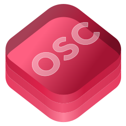

<p align="center">
    
</p>

# CoreOSC
[](https://github.com/sammysmallman/CoreOSC/actions/workflows/build.yml) [](https://github.com/sammysmallman/CoreOSC/blob/main/LICENSE.md)

CoreOSC provides the infrastructural value types for your apps to communicate among computers, sound synthesisers and other multimedia devices via [OSC](https://opensoundcontrol.stanford.edu): messages, bundles, time tags and every required argument type from [OSC 1.1](https://opensoundcontrol.stanford.edu/files/2009-NIME-OSC-1.1.pdf), together with validated address types, pattern matching, and the address space and filter machinery an OSC server needs to invoke methods from received packets.

The package is transport-agnostic — it produces and consumes the `Data` an OSC packet is on the wire, and leaves the networking to a transport library such as [swift-open-sound-control](https://github.com/artifice-industries/swift-open-sound-control).

## Features

- OSC Messages, Bundles and Time Tags with all OSC 1.1 argument types
- Single-buffer packet encoding and bounds-checked parsing
- Validated address types with byte-loop validators on the hot paths
- OSC 1.0 pattern matching: `*`, `?`, `[]`, `{}` wildcards
- Address spaces and address filters for dispatching received messages to methods
- Address stores for network-level filtering without method invocation
- Human-readable message annotations
- Sendable value types throughout, ready for Swift concurrency

## Installation

Add the package dependency to your Xcode project or `Package.swift` using the repository URL:

```swift
dependencies: [
    .package(url: "https://github.com/sammysmallman/CoreOSC", .upToNextMajor(from: "2.2.2"))
]
```

Platforms: iOS 13+, macOS 10.15+, tvOS 13+, watchOS 6+.

API documentation is available as a DocC catalogue: build it in Xcode with Product ▸ Build Documentation.

## Architecture

### Addresses

An address has a similar syntax to a URL and begins with the character "/", followed by the names of all the containers, in order, along the path from the root of the tree to the method, separated by forward slash characters, followed by the name of the method. All types of addresses found in CoreOSC contain ASCII characters only, as specified in [OSC 1.0](https://opensoundcontrol.stanford.edu/spec-1_0.html).

#### OSC Address Pattern

An address pattern is an address to a potential destination of one or more methods hosted by an "OSC Server". A number of wildcard characters, such as "*", can be used to allow for a single address pattern to invoke multiple methods.

```swift
let addressPattern = try OSCAddressPattern("/core/osc/*")
```

Initialisation of an `OSCAddressPattern` will `throw` if the format is incorrect or invalid characters are found in the given `String`.

A `String` can be evaluated to verify whether it is a valid address pattern by using the following:

```swift
if case .failure(let error) = OSCAddressPattern.evaluate(with: "/core/osc/*") {
    print(error.localizedDescription)
}
```

#### OSC Address

An address is the path to a method hosted by an "OSC Server". No wildcard characters are allowed as this address signifies the endpoint of an `OSCMessage` and the full path a message traverses to invoke the method associated with it.

```swift
let address = try OSCAddress("/core/osc/method")
```

Initialisation of an `OSCAddress` will `throw` if the format is incorrect or invalid characters are found in the given `String`.

A `String` can be evaluated to verify whether it is a valid address by using the following:

```swift
if case .failure(let error) = OSCAddress.evaluate(with: "/core/osc/method") {
    print(error.localizedDescription)
}
```

---

### Messages

An `OSCMessage` is a packet formed of an `OSCAddressPattern` that directs it towards one or more methods hosted by an "OSC Server" and arguments that can be used when invoking the methods.

```swift
let message = try OSCMessage(
    with: "/core/osc/*",
    arguments: [
        .int32(1),
        .float32(3.142),
        .string("Core OSC"),
        .timeTag(.immediate),
        .true,
        .false,
        .blob(Data([0x01, 0x01])),
        .nil,
        .impulse
    ]
)
```

Initialisation with a `String` address pattern will `throw` if the format is incorrect or invalid characters are found. Initialising with an already validated `OSCAddressPattern` does not throw:

```swift
let addressPattern = try OSCAddressPattern("/core/osc/*")
let message = OSCMessage(with: addressPattern, arguments: [.int32(1)])
```

---

### Bundles

An `OSCBundle` is a container for messages, but also other bundles, and allows for the invocation of multiple messages atomically as well as scheduling them to be invoked at some point in the future. For further information regarding the temporal semantics of bundles and their associated `OSCTimeTag`s, please see [OSC 1.0](https://opensoundcontrol.stanford.edu/spec-1_0.html).

```swift
let bundle = OSCBundle(
    [
        .message(try OSCMessage(with: "/core/osc/1")),
        .message(try OSCMessage(with: "/core/osc/2")),
        .message(try OSCMessage(with: "/core/osc/3"))
    ],
    timeTag: .immediate
)
```

---

### Encoding & Parsing

Every packet type encodes to its wire representation with `data()`, writing the whole packet into a single capacity-reserved buffer:

```swift
let data = message.data()
```

`OSCParser` performs the reverse, returning an `OSCPacket` from received `Data`:

```swift
let packet = try OSCParser.packet(from: data)
if case .message(let message) = packet {
    print(message.addressPattern.fullPath)
}
```

---

### Address Spaces

An `OSCAddressSpace` is a set of methods hosted by an "OSC Server" that can be invoked by one or more `OSCMessage`s. Think of it as a container for blocks of code that can be dispatched when a message is received with an address pattern that matches against a method's `OSCAddress`.

#### Methods

An `OSCMethod` encapsulates a closure and the `OSCAddress` needed to invoke it. To make control functionality available to "OSC Clients", create `OSCMethod`s, add them to an `OSCAddressSpace`, and pass each received `OSCMessage` to the address space to invoke the methods it matches.

```swift
let method = OSCMethod(with: try OSCAddress("/object/coords")) { message, _ in
    guard message.arguments.count == 2,
          case let .float32(x) = message.arguments[0],
          case let .float32(y) = message.arguments[1]
    else { return }
    print("Received /object/coords, x: \(x), y: \(y)")
}

let addressSpace = OSCAddressSpace(methods: [method])

let message = try OSCMessage(with: "/object/coords", arguments: [.float32(3), .float32(5)])
addressSpace.invoke(with: message)
// Prints "Received /object/coords, x: 3.0, y: 5.0"
```

## Extensions

The following objects are not part of either OSC specification but have been developed after observation of implementations of OSC in the wild and aim to provide help and functionality in specific OSC communication scenarios.

### Address Store

An `OSCAddressStore` is a container of `OSCAddress`es and is a simplified version of an `OSCAddressSpace` without any method invocation. Calling `filter(with:)` returns the `OSCAddress`es that would be invoked by an address pattern. For a network filter with method invocation further up the stack, `matches(with:)` short-circuits at the first hit and `count(with:)` returns the number of matches — a count of 0 would indicate dropping the packet.

```swift
let store = OSCAddressStore(addresses: [
    try OSCAddress("/core/osc/1"),
    try OSCAddress("/core/osc/2"),
    try OSCAddress("/core/osc/3")
])

let pattern = try OSCAddressPattern("/core/osc/*")
store.filter(with: pattern)  // All three addresses.
store.count(with: pattern)   // 3
store.matches(with: pattern) // true
```

### Annotations

An OSC annotation is a script for writing an `OSCMessage` in a human-readable format, allowing your users to quickly create `OSCMessage`s by typing them out as well as presenting them in logs. There are two available styles: it is strongly recommended that `OSCAnnotationStyle.spaces` is used rather than `OSCAnnotationStyle.equalsComma`, as it leaves the valid "=" character available for your `OSCAddressPattern`s.

A `String` can be evaluated to verify whether it is a valid annotation by using the following:

```swift
let annotation = "/core/osc 1 3.142 \"a string with spaces\" aString true"
let valid = OSCAnnotation.evaluate(annotation, style: .spaces)
```

An `OSCMessage` can be initialised from a valid OSC annotation:

```swift
let message = OSCAnnotation.message(for: annotation, style: .spaces)
```

An OSC annotation can be initialised from an `OSCMessage`:

```swift
let message = try OSCMessage(
    with: "/core/osc",
    arguments: [.int32(1), .float32(3.142), .string("Core OSC")]
)

OSCAnnotation.annotation(for: message, style: .spaces, type: false)
// /core/osc 1 3.142 "Core OSC"

OSCAnnotation.annotation(for: message, style: .spaces, type: true)
// /core/osc 1(i) 3.142(f) "Core OSC"(s)
```

---

### Address Filters

An `OSCAddressFilter` is kind of the reverse of an `OSCAddressSpace`. Where an address space allows for an address pattern to invoke multiple predefined methods, an address filter allows for a single method to be invoked by multiple loosely formatted address patterns by using a "#" wildcard character. Think of an address filter as a container for blocks of code that can be dispatched when a message is received with an address pattern that matches against a filter method's `OSCFilterAddress`.

#### Filter Methods

An `OSCFilterMethod` encapsulates a closure and the `OSCFilterAddress` needed to invoke it, without the overhead of establishing an address space containing an `OSCAddress` and method for each piece of control functionality.

```swift
let method = OSCFilterMethod(with: try OSCFilterAddress("/cue/#/fired")) { message, _ in
    print("Cue \(message.addressPattern.parts[1]) fired")
}

let addressFilter = OSCAddressFilter(methods: [method])

_ = addressFilter.invoke(with: try OSCMessage(with: "/cue/1/fired")) // Prints "Cue 1 fired"
_ = addressFilter.invoke(with: try OSCMessage(with: "/cue/2/fired")) // Prints "Cue 2 fired"
```

### Filter Address Store

An `OSCFilterAddressStore` is a container of `OSCFilterAddress`es and is a simplified version of an `OSCAddressFilter` without any method invocation, with the same `filter(with:)`, `count(with:)` and `matches(with:)` API as `OSCAddressStore`.

```swift
let store = OSCFilterAddressStore(addresses: [
    try OSCFilterAddress("/core/osc/#"),
    try OSCFilterAddress("/core/osc/test/something")
])

let pattern = try OSCAddressPattern("/core/osc/1")
store.filter(with: pattern)  // [/core/osc/#]
store.count(with: pattern)   // 1
store.matches(with: pattern) // true
```

:warning: An `OSCFilterAddress` uses the "#" character, which has been specifically chosen because it is invalid within an `OSCAddressPattern`. Under no circumstances should you attempt to create an `OSCMessage` using an `OSCFilterAddress` as its address pattern.

---

### Refracting

An `OSCRefractingAddress` can be used to "refract" an `OSCAddressPattern` to something else. The core idea for this object is to allow an "OSC Server" to act as a router, taking an `OSCMessage` from one application and routing it to another with modifications made to the address pattern. Refracting is made possible by using a "#" wildcard character suffixed by a part index number (not 0 indexed). Where a wildcard is used within the refracting address, the part will be replaced by the part from the given address pattern. To be successful at refracting, the suffixed index number must be valid with regards to the given address pattern's number of parts.

```swift
let refractingAddress = try OSCRefractingAddress("/core/#2/#4")

let addressPattern = try OSCAddressPattern("/core/osc/refracting/test")

let refractedAddress = try refractingAddress.refract(address: addressPattern)

print(refractedAddress.fullPath) // "/core/osc/test"
```

A `String` can be evaluated to verify whether it is a valid refracting address by using the following:

```swift
if case .failure(let error) = OSCRefractingAddress.evaluate(with: "/core/#2/#4") {
    print(error.localizedDescription)
}
```

:warning: An `OSCRefractingAddress` uses the "#" character, which has been specifically chosen because it is invalid within an `OSCAddressPattern`. Under no circumstances should you attempt to create an `OSCMessage` using an `OSCRefractingAddress` as its address pattern.

## License

CoreOSC is licensed under the GNU Affero General Public License, version 3. If you require a commercial license for an application that you would not like to trigger AGPLv3 obligations (e.g. open sourcing your application), please get in touch.

## Authors

**Sammy Smallman** - *Initial Work* - [SammySmallman](https://github.com/sammysmallman)

See also the list of [contributors](https://github.com/sammysmallman/CoreOSC/graphs/contributors) who participated in this project.
